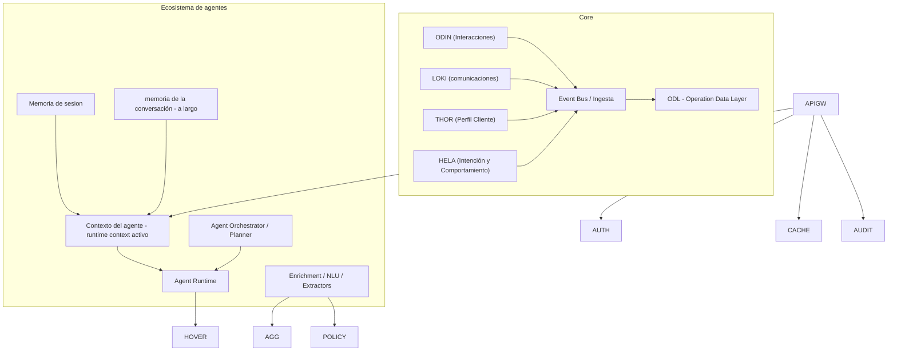

```mermaid
flowchart TD

  subgraph TRAD["Core"]
    A1["ODIN (Interacciones)"]
    A2["LOKI (comunicaciones)"]
    A3["THOR (Perfil Cliente)"]
    A4["HELA (Intención y Comportamiento)"]

    EB["Event Bus / Ingesta"]
    ODL["ODL - Operation Data Layer"]
    
    A1 --> EB
    A2 --> EB
    A3 --> EB
    A4 --> EB
    EB --> ODL
  end

  subgraph GENAI["Ecosistema de agentes"]
    STM["Memoria de sesion"]
    CTX["Contexto del agente - runtime context activo"]
    VEC["memoria de la conversación - a largo"]
    R1["Agent Runtime"]
    ORCH["Agent Orchestrator / Planner"]
    ENRICH["Enrichment / NLU / Extractors"]

    STM --> CTX
    VEC --> CTX
    CTX --> R1
    ORCH --> R1
  end

  APIGW --> CTX
  ENRICH --> AGG
  ENRICH --> POLICY
  APIGW --> AUTH
  APIGW --> CACHE
  APIGW --> AUDIT
  R1 --> HOVER

```
