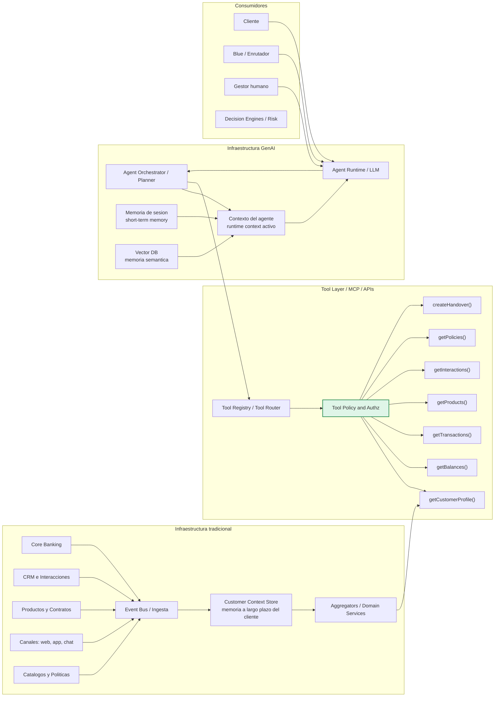

```mermaid
flowchart LR
  %% Infra tradicional
  subgraph TRAD[Infraestructura tradicional]
    CORE["Core Banking"]
    CRM["CRM e Interacciones"]
    PROD["Productos y Contratos"]
    CH["Canales: web, app, chat"]
    POL["Catalogos y Politicas"]
    EVT["Event Bus / Ingesta"]
    CAS["Customer Context Store
memoria a largo plazo del cliente"]
    AGG["Aggregators / Domain Services"]

    CORE --> EVT
    CRM --> EVT
    PROD --> EVT
    CH --> EVT
    POL --> EVT
    EVT --> CAS
    CAS --> AGG
  end

  %% Tool layer
  subgraph TOOLS[Tool Layer / MCP / APIs]
    T1["getCustomerProfile()"]
    T2["getBalances()"]
    T3["getTransactions()"]
    T4["getProducts()"]
    T5["getInteractions()"]
    T6["getPolicies()"]
    T7["createHandover()"]
    TSEL["Tool Registry / Tool Router"]
    TPOL["Tool Policy and Authz"]
  end

  %% Infra GenAI
  subgraph GENAI[Infraestructura GenAI]
    ORCH["Agent Orchestrator / Planner"]
    CTX["Contexto del agente
runtime context activo"]
    STM["Memoria de sesion
short-term memory"]
    VEC["Vector DB
memoria semantica"]
    LLM["Agent Runtime / LLM"]
  end

  %% Consumidores
  subgraph CONS[Consumidores]
    U1["Cliente"]
    U2["Blue / Enrutador"]
    U3["Gestor humano"]
    U4["Decision Engines / Risk"]
  end

  %% Flujos principales
  U1 --> LLM
  U2 --> LLM
  U3 --> LLM

  LLM --> ORCH
  ORCH --> CTX
  STM --> CTX
  VEC --> CTX
  CTX --> LLM

  ORCH --> TSEL
  TSEL --> TPOL
  TPOL --> T1
  TPOL --> T2
  TPOL --> T3
  TPOL --> T4
  TPOL --> T5
  TPOL --> T6
  TPOL --> T7

  AGG --> T1
  style TPOL fill:#dff5e8,stroke:#2f8f57,stroke-width:2px

```
