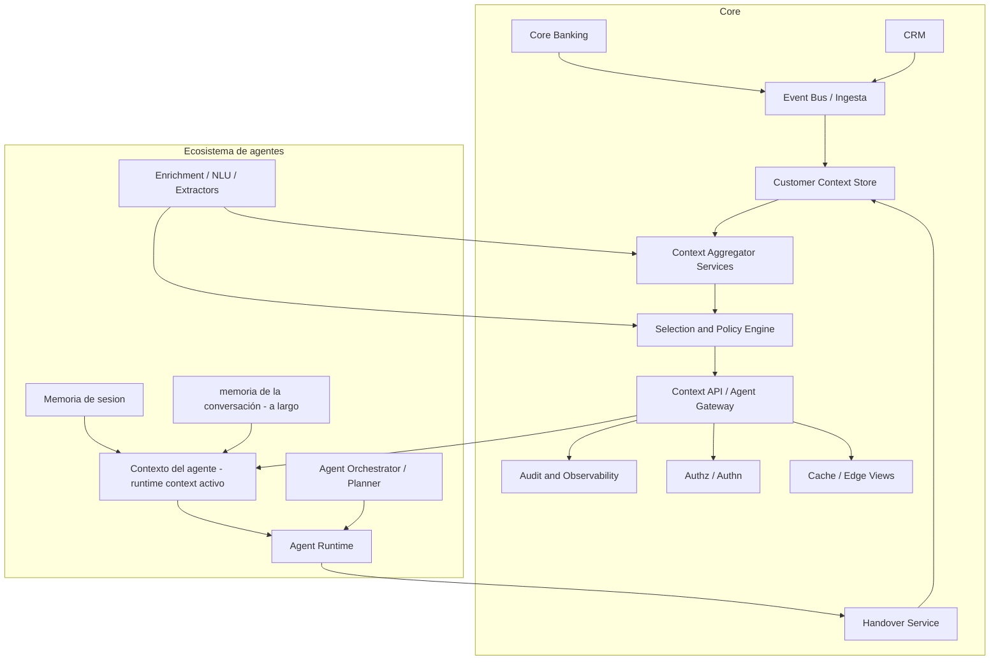

```mermaid
flowchart TD

  subgraph TRAD["Core"]
    A1["Core Banking"]
    A2["CRM"]
    EB["Event Bus / Ingesta"]
    CAS["Customer Context Store"]
    AGG["Context Aggregator Services"]
    POLICY["Selection and Policy Engine"]
    APIGW["Context API / Agent Gateway"]
    HOVER["Handover Service"]
    AUDIT["Audit and Observability"]
    AUTH["Authz / Authn"]
    CACHE["Cache / Edge Views"]

    A1 --> EB
    A2 --> EB
    EB --> CAS
    CAS --> AGG
    AGG --> POLICY
    POLICY --> APIGW
    HOVER --> CAS
  end

  subgraph GENAI["Ecosistema de agentes"]
    STM["Memoria de sesion"]
    CTX["Contexto del agente - runtime context activo"]
    VEC["memoria de la conversación - a largo"]
    R1["Agent Runtime"]
    ORCH["Agent Orchestrator / Planner"]
    ENRICH["Enrichment / NLU / Extractors"]

    STM --> CTX
    VEC --> CTX
    CTX --> R1
    ORCH --> R1
  end

  APIGW --> CTX
  ENRICH --> AGG
  ENRICH --> POLICY
  APIGW --> AUTH
  APIGW --> CACHE
  APIGW --> AUDIT
  R1 --> HOVER

```
