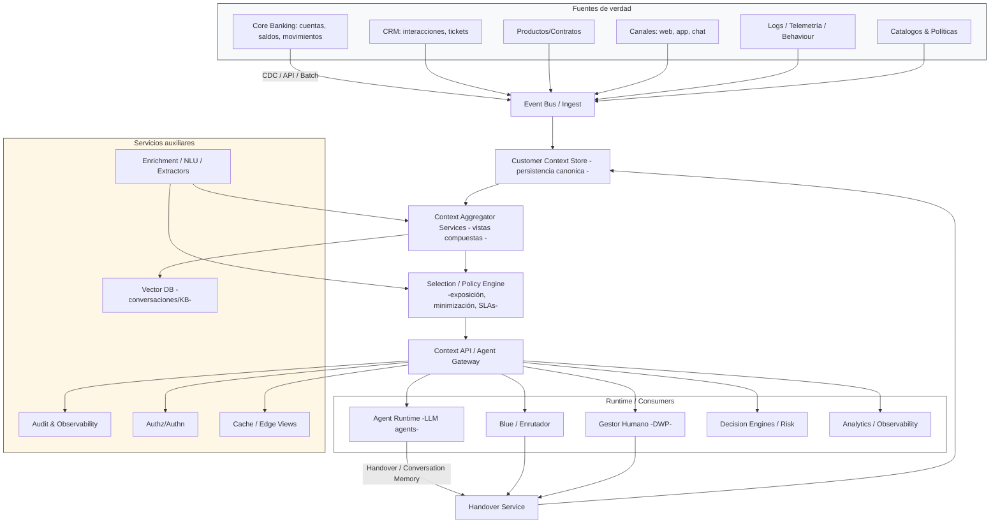

```mermaid
flowchart TD
  subgraph SOURCES [Fuentes de verdad]
    A1[Core Banking: cuentas, saldos, movimientos]
    A2[CRM: interacciones, tickets]
    A3[Productos/Contratos]
    A4[Canales: web, app, chat]
    A5[Logs / Telemetría / Behaviour]
    A6[Catalogos & Políticas]
  end

  A1 -->|CDC / API / Batch| EB[Event Bus / Ingest]
  A2 --> EB
  A3 --> EB
  A4 --> EB
  A5 --> EB
  A6 --> EB

  EB --> CAS[Customer Context Store - persistencia canonica -]

  CAS --> AGG[Context Aggregator Services - vistas compuestas -]

  AGG --> POLICY[Selection / Policy Engine
  -exposición, minimización, SLAs-]

  POLICY --> APIGW[Context API / Agent Gateway]

  subgraph RUNTIME [Runtime / Consumers]
    R1[Agent Runtime -LLM agents-]
    R2[Blue / Enrutador]
    R3[Gestor Humano -DWP-]
    R4[Decision Engines / Risk]
    R5[Analytics / Observability]
  end

  APIGW --> R1
  APIGW --> R2
  APIGW --> R3
  APIGW --> R4
  APIGW --> R5

  R1 -->|Handover / Conversation Memory| HOVER[Handover Service]
  R2 --> HOVER
  R3 --> HOVER
  HOVER --> CAS

  subgraph AUX [Servicios auxiliares]
    VEC[Vector DB -conversaciones/KB-]
    AUDIT[Audit & Observability]
    AUTH[Authz/Authn]
    CACHE[Cache / Edge Views]
    ENRICH[Enrichment / NLU / Extractors]
  end

  AGG --> VEC
  APIGW --> AUTH
  APIGW --> CACHE
  APIGW --> AUDIT
  ENRICH --> AGG
  ENRICH --> POLICY

  style SOURCES fill:#f8f9fa,stroke:#333,stroke-width:1px
  style RUNTIME fill:#ffffff,stroke:#333,stroke-width:1px
  style AUX fill:#fff7e6,stroke:#333,stroke-width:1px

```
